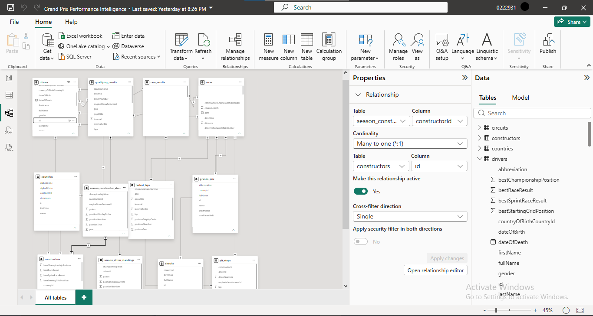
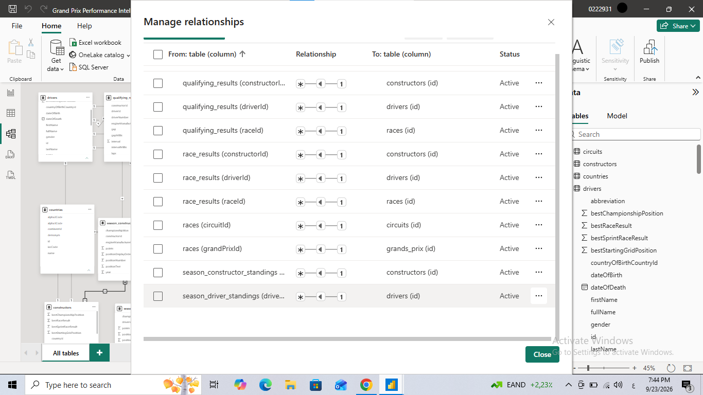
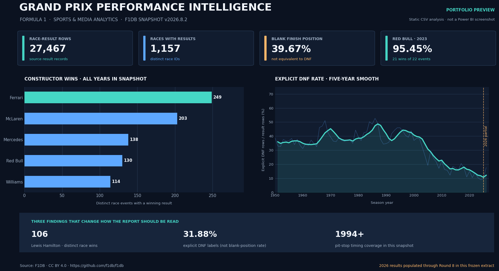

# Grand Prix Performance Intelligence

**Power BI · Power Query · DAX · Python**

This project looks at Formula 1 results across seasons. I used it to compare drivers and constructors, follow performance over time, and check how data quality can change the story a KPI tells.

The source is the open-source F1DB database. The copy used here is release `v2026.8.2`, dated 2 July 2026 in the source notes. It contains 12 CSV files covering races, results, drivers, constructors, circuits, qualifying, pit stops and season standings.

## What I worked on

- Imported and reviewed the CSV tables in Power Query.
- Fixed data types, handled error rows and empty columns, and created a date table for time-based analysis.
- Set up 14 relationships between the race, driver, constructor, circuit, qualifying and result tables, using single-direction filtering.
- Wrote DAX measures for wins, points, podiums, win rate, non-classified results, position change and year-over-year comparisons, along with more advanced comparisons.
- Built report views for the overall picture, season trends, circuits, driver and constructor comparisons, qualifying performance, and reliability.
- Used Python to double-check selected counts and data-quality findings against the raw CSV files.

I kept the query and measure definitions in this repository so the logic is visible and can be reused. The `.pbix` file is not included in this shareable copy. The screenshots below are from my Power BI Desktop work session; the separate CSV preview is generated from the included analysis script and is not a Power BI screenshot.

## Screenshots

**Power BI model view**



**Manage relationships**



**CSV analysis preview**



## Dataset at a glance

The files are included under `data/raw/`. The counts below are based on this snapshot, not live F1 data.

| Table | Rows | What it contains |
|---|---:|---|
| `races.csv` | 1,171 | Scheduled race events and dates |
| `race_results.csv` | 27,467 | Result records, points, finishing positions and status text |
| `qualifying_results.csv` | 26,888 | Qualifying results |
| `pit_stops.csv` | 22,308 | Recorded pit stops |
| `fastest_laps.csv` | 17,020 | Fastest-lap records |
| `drivers.csv` | 917 | Driver reference data |
| `constructors.csv` | 187 | Constructor/team reference data |
| `circuits.csv` | 78 | Circuit details and location |
| `countries.csv` | 249 | Country reference data |
| `grands_prix.csv` | 54 | Grand Prix identities |
| `season_driver_standings.csv` | 1,680 | Driver standings by season |
| `season_constructor_standings.csv` | 721 | Constructor standings by season |

There are 98,740 rows across the 12 CSV files. Row counts are rechecked by `scripts/run_analysis.py` rather than being hard-coded into the analysis output.

## Main questions

- Which drivers and constructors have the most race wins in this snapshot?
- Which constructor seasons had the highest share of races won?
- How did explicit DNF rates change across broad periods?
- How many result rows have a blank finish position, and how is that different from an explicit DNF?
- Which Grand Prix names have been associated with more than one physical circuit?
- What should be treated carefully when comparing data across different eras?

## Findings worth calling out

1. Red Bull won **21 of 22 races in 2023**, a **95.45% win share** in this dataset.
2. **10,897 of 27,467 result rows (39.67%)** have a blank numeric finishing position. **8,756 rows (31.88%)** are labelled `DNF`. Those are different definitions, so I kept them separate.
3. The source contains **14 scheduled 2026 race rows without result rows**. The 2026 season is partial in this snapshot; missing rows should not be treated as cancelled races or zero performance.
4. Some combinations that look like natural keys are repeated in the source. I flagged those cases for review instead of deleting source rows without checking their meaning.
5. The pit-stop table in this snapshot starts in 1994, so earlier years do not represent zero pit stops; they represent no pit-stop data in this file.

The detailed counts and the definitions behind them are in [`outputs/DATA_AUDIT_REPORT.md`](outputs/DATA_AUDIT_REPORT.md) and [`docs/EXECUTIVE_ANALYSIS.md`](docs/EXECUTIVE_ANALYSIS.md).

## Model and transformations

The model separates race-event data from season-standing data. This matters because one row in a race result table and one row in a season standings table do not represent the same thing. Mixing them into one table can duplicate points or counts.

| Group | Tables |
|---|---|
| Dimensions | `Dim_Date`, `Dim_Races`, `Dim_Drivers`, `Dim_Constructors`, `Dim_Circuits`, `Dim_GrandPrix`, `Dim_Season` |
| Race-level facts | `Fact_RaceResults`, `Fact_Qualifying`, `Fact_FastestLaps`, `Fact_PitStops` |
| Season-level facts | `Fact_SeasonDriverStandings`, `Fact_SeasonConstructorStandings` |
| QA reference queries | `QA_SourceProvidedTotals_Drivers`, `QA_SourceProvidedTotals_Constructors` |

The Power Query files are in `powerbi/power_query/`. The dimensional-model measure library is `powerbi/dax/measures.dax`; core measures using the source-table names shown in the screenshots are in `powerbi/dax/core_measures_source_model.dax`. The relationship layout is in `powerbi/model/relationships.mmd`. See [`docs/DATA_MODEL.md`](docs/DATA_MODEL.md) and [`docs/TRANSFORMATION_DECISIONS.md`](docs/TRANSFORMATION_DECISIONS.md) for the model and cleanup choices.

## Run the CSV checks

Python 3.10 or newer is recommended. From the project root:

```bash
python -m pip install -r requirements.txt
python scripts/run_analysis.py
python -m unittest discover -s tests -v
python scripts/make_preview.py
```

The script reads from `data/raw/` and recreates the tables in `outputs/`. It does not edit the original CSV files. The unit tests check key facts about the snapshot and the data-quality logic.

## Power BI files

The M files are individual Power Query queries, not one single script. To rebuild the model in Power BI Desktop:

1. Create a Text parameter named `pDataFolder`, pointing to the full path of `data/raw/`.
2. Add the `Staging_*.pq` queries and turn off load for staging queries.
3. Add the `fx*.pq` helper functions.
4. Add the dimension and fact queries, using the names from the file names.
5. Create the relationships listed in `docs/DATA_MODEL.md`, with single-direction filtering from dimensions to facts.
6. Add the DAX measures and compare their results with the CSV outputs where the definitions match.

The screenshots show parts of my Power BI Desktop model setup. I did not include the editable `.pbix` in this repository, so the code, screenshots and analysis files are the shareable project record.

## Source and attribution

The CSV files come from [F1DB — Open Source Formula 1 Database](https://github.com/f1db/f1db). The source documentation for this snapshot specifies **CC BY 4.0** for the data. Attribution:

> Data sourced from F1DB (https://github.com/f1db/f1db), licensed under CC BY 4.0.

The `LICENSE` file applies to the project code and documentation, not to the third-party source data.

## Limitations to keep in mind

- This is a fixed snapshot, not a live connection. The 2026 result data is incomplete.
- Championship scoring and race formats changed over time; raw points totals should not be compared across every era without context.
- A blank `positionNumber` is not automatically an explicit DNF.
- Some candidate keys are repeated in the source. The project flags these rather than silently removing them.
- Pit-stop data begins in 1994 in this extract.

## Repository layout

```text
Grand_Prix_Performance_Intelligence/
├── README.md
├── data/raw/                 # 12 source CSV files
├── scripts/                  # repeatable Python analysis and preview
├── tests/                    # checks for the source snapshot
├── outputs/                  # audit tables, summaries and leaderboards
├── requirements/             # project / business requirements
├── analysis/                 # business questions and executive report
├── powerbi/power_query/      # M queries and helper functions
├── powerbi/dax/              # core and dimensional-model measures
├── powerbi/model/            # relationship diagram
├── docs/                     # model, source, measures, QA and build notes
├── assets/                   # analysis preview and Power BI screenshots
├── interview/                # project walkthrough
└── portfolio/                # CV and LinkedIn drafts
```

**Project owner:** Abdulaziz Salem

## Portfolio files

- [Executive analysis](analysis/Executive_Analysis_Report.md)
- [Business questions and answers](analysis/BUSINESS_QUESTIONS.md)
- [Data-quality decisions](docs/TRANSFORMATION_DECISIONS.md)
- [Dashboard pages](docs/DASHBOARD_SPEC.md)
- [Interview notes](interview/PROJECT_WALKTHROUGH.md)
- [CV bullets](portfolio/CV_BULLETS.md)
- [LinkedIn post — English](portfolio/LINKEDIN_POST_EN.md)
- [LinkedIn post — Arabic](portfolio/LINKEDIN_POST_AR.md)
